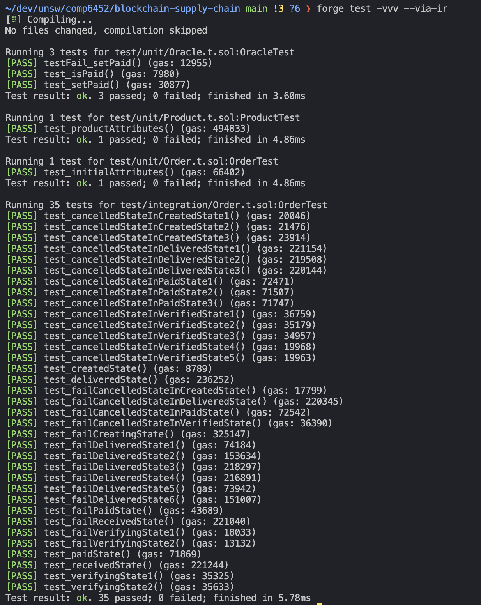
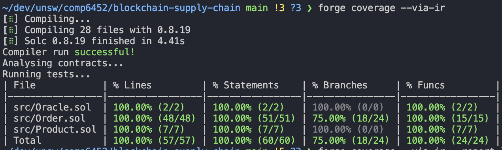

# blockchain-supply-chain

## Usage
Contracts are in src/

Offchain components are in offchain/

To use, run the commands "truffle compile" and "truffle develop", then in a separate terminal navigate to offchain/ and run app.py. This will provide a command line interface for using the various features.

### Details
BUYER_ADDRESS=0x0f4FF0d23D1E116e41b151CA256b6a91ea1dA634
SELLER_ADDRESS=0x77d6174c11E9081c2Fe1bd2ba05d00E80A801749
ORACLE_ADDRESS=0xAafF9C66F4Bb7709F9325892336623B9395a177e
LONDON_ADDRESS=0xE8e94cCc3eFAf97534Cf73fd4Dc70347c4b6B529 (also known as SHIPPER_ADDRESS)
SINGAPORE_ADDRESS=0x421aebCAfb422Cfa725313c3884951760b131b98
SYDNEY_ADDRESS=0x649f9bbdC22cc8412E143E40513239aC13C7BD73

PRODUCT_ADDRESS=0x3dcc4be1d2899df61e2b815ffe60029ebe6970df
ORACLE_ADDRESS=0xaf5c971c0b3a2127c93a0eda9053aad5945b82ef
ORDER_ADDRESS=0x2040c43923afe3e4252c9b82a1d2e9f1ca438897

## Testing and Coverage

### Demonstration
[YouTube](https://www.youtube.com/watch?v=PrK1-6fld6M)
